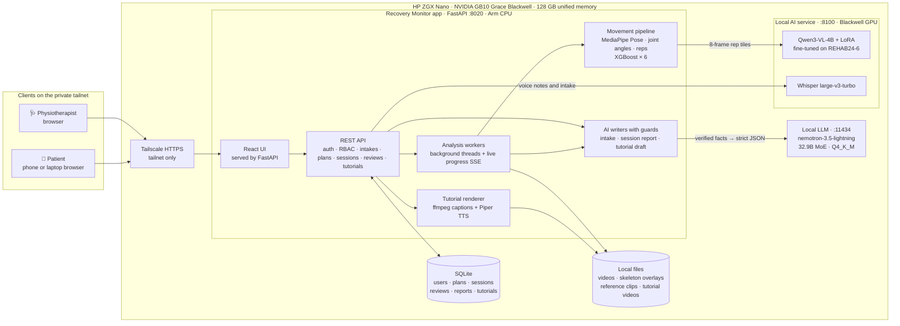
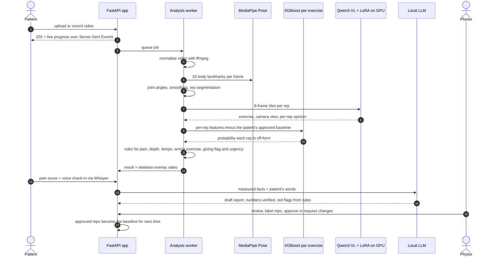
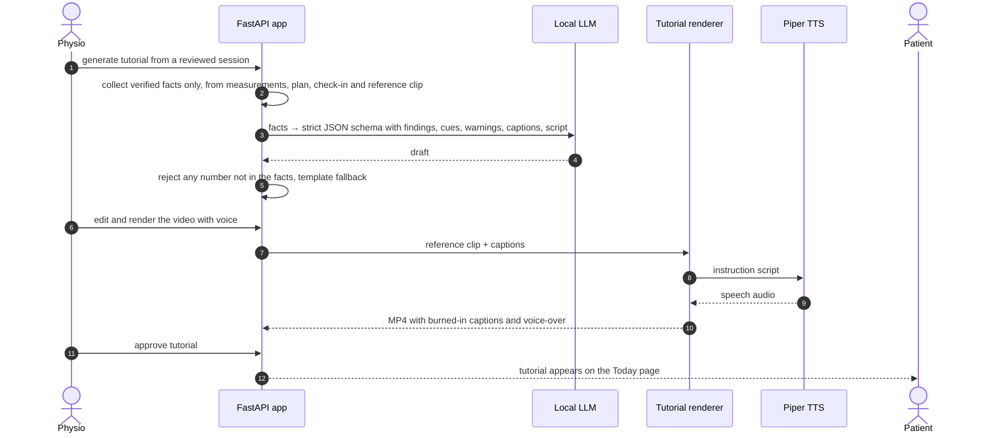
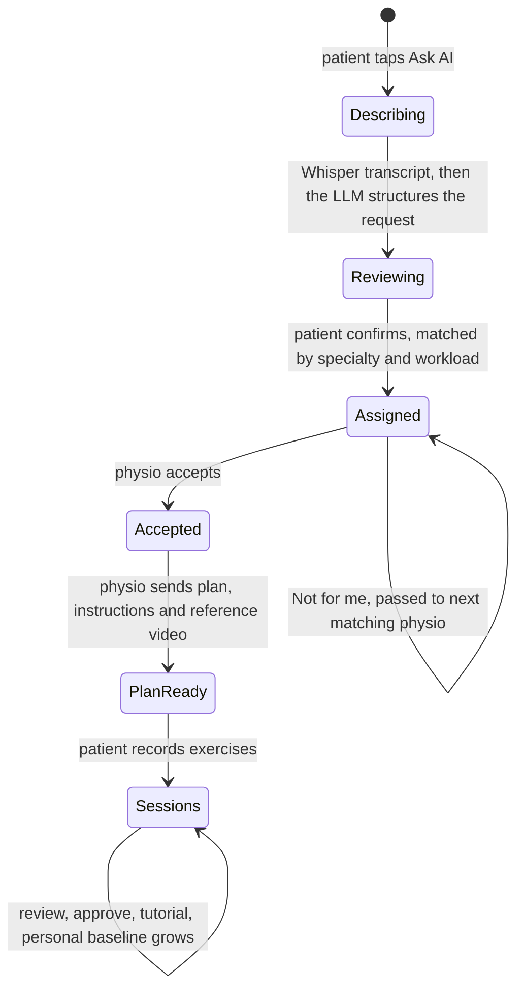
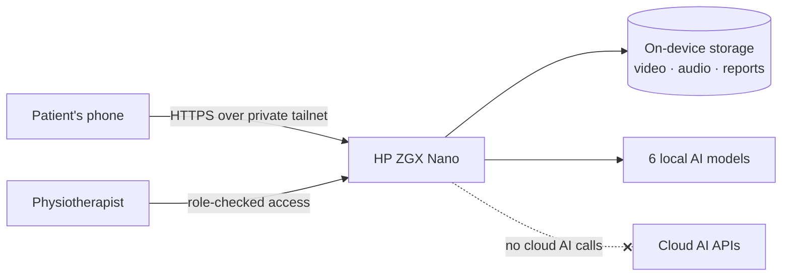

<div align="center">

# Recovery Monitor


### On-device AI that turns home rehab exercise into evidence a physiotherapist can trust

Built for the **HP ZGX Nano** (NVIDIA GB10 Grace Blackwell). Video, voice and all six AI models stay on the device.


-lightgrey)

</div>

---

## Contents

1. [The problem](#1-the-problem)
2. [What Recovery Monitor does](#2-what-recovery-monitor-does)
3. [Results at a glance](#3-results-at-a-glance)
4. [System architecture](#4-system-architecture)
5. [The AI models: sizes, parameters, training](#5-the-ai-models-sizes-parameters-training)
6. [Edge AI on the HP ZGX Nano](#6-edge-ai-on-the-hp-zgx-nano)
7. [Privacy by design](#7-privacy-by-design)
8. [Safety by design](#8-safety-by-design)
9. [Quick start](#9-quick-start-hp-zgx-nano)
10. [Using the app](#10-using-the-app)
11. [Detailed evaluation](#11-detailed-evaluation)
12. [Reproducing the models](#12-reproducing-the-models)
13. [Configuration](#13-configuration)
14. [API overview](#14-api-overview)
15. [Repository layout](#15-repository-layout)
16. [Limitations](#16-limitations)
17. [Key facts for slides](#17-key-facts-for-slides)

---

## 1. The problem

Most physical rehabilitation happens **at home, unsupervised**. Between appointments a physiotherapist
cannot see whether exercises are done correctly, whether pain is creeping up, or whether the patient is doing
them at all. Patients film themselves, but a phone video is not evidence: someone still has to watch it,
measure it and compare it with last week. And a rehab video is **health data**: many patients and clinics
will not upload it to a cloud AI service.

## 2. What Recovery Monitor does

A patient describes their problem by voice, gets matched to a physiotherapist, records their exercises at
home and says how it felt. The **HP ZGX Nano** analyses everything locally and gives the physiotherapist a
review with measurements, flagged reps, a drafted report and a personalised tutorial video. **The
physiotherapist makes every decision**; approved sessions become the patient's personal baseline, so the
analysis gets more personal over time.


**For patients**
- **Ask AI:** tap a glowing mic and describe the problem in your own words. Whisper transcribes on the
  device; a local LLM turns it into a structured request (area, pain, duration, trend, goals, mood) that the
  patient checks and edits before sending.
- **Care team:** a live timeline: request sent → matched → accepted → plan ready.
- **Today:** the prescribed exercise, the physio's instructions and a *correct-form reference clip*; record
  with the camera or upload a video, watch live analysis progress, then check in with a pain score and voice
  note. Approved **AI exercise tutorials** (video, voice-over, cues, captions) appear here too.
- **My progress:** trend of movement quality and pain across sessions.

**For physiotherapists**
- **New requests:** auto-assigned by specialty (upper body / lower body / general mobility) and workload,
  each written up by the AI with the patient's own words, mood, red flags and a suggested starting exercise.
- **Plan editor:** all six exercises, the ones that fit the patient's problem marked, fields that adapt to the
  exercise, and a matching correct-form reference video.
- **Review queue:** urgent first. Each review shows the skeleton-overlay video synced to the joint-angle chart,
  rep-by-rep verdicts with reasons, the patient's pain and words, and an AI draft report that stays collapsed
  until you want the detail.
- **AI exercise tutorial:** from a reviewed session, generate a personalised tutorial (findings, coaching cues,
  warnings, captions, script) built only from verified facts, render it as a video with burned-in captions and
  an optional **Piper** voice-over, edit it, and approve it for the patient.

**Six exercises** (from REHAB24-6): squat, lunge, leg raise to the side, arm raise to the side, arm V-W,
push-ups with hands on a table.

## 3. Results at a glance

All numbers are measured on people the models never saw during training (leave-one-subject-out or held-out
subjects). Full tables are in [section 11](#11-detailed-evaluation).

| What | Result |
|---|---|
| Knee angle vs. 16-camera optical motion capture (side view, 9,825 frames) | **±5.3° mean absolute error** |
| Exercise recognition, fine-tuned Qwen3-VL-4B vs. zero-shot (476 held-out reps) | **63.4% → 99.2%** |
| Camera-view recognition, fine-tuned vs. zero-shot | **31.3% → 97.9%** |
| Vision model speed after fine-tuning | **2.92 s → 1.33 s per rep** |
| Fine-tuning cost on the Nano itself | **66 minutes**, 33 M trainable parameters (0.74% of 4.4 B) |
| Incorrect-rep detection, XGBoost vs. patient baseline (F1, 6 exercises) | **0.62 – 0.85** |
| Rep counting, squat (390 annotated reps) | **91% precision, 87% recall** (97% recall filmed side-on) |
| Voice to text (Whisper large-v3-turbo on the GB10) | **11 s of speech in 0.25 s** |
| AI intake: real voice note → structured request | **~4 s** |
| Tutorial voice-over (Piper) | **< 1 s** per coaching script |

## 4. System architecture

Everything runs on one HP ZGX Nano. Phones and laptops reach it over a private Tailscale network (HTTPS,
tailnet only); nothing is sent to a cloud AI service.



### How one exercise video is analysed



### How a personalised tutorial is made



### From "it hurts" to an exercise plan



## 5. The AI models: sizes, parameters, training

Six AI models, all running on the Nano. Parameter counts are read from the model files on the device.

| # | Model | Parameters | Size / precision | Runs on | Role | Trained by us |
|---|---|---:|---|---|---|---|
| 1 | **MediaPipe Pose Landmarker (full)** | BlazePose GHUM | 9.4 MB `.task` | Arm CPU | 33 body landmarks per video frame | used as-is |
| 2 | **XGBoost × 6** (one per exercise) | 200 trees × depth 3 each | ~110–190 KB JSON each | Arm CPU | probability a rep is off-form vs. the patient's own approved reps | **yes** |
| 3 | **Qwen3-VL-4B-Instruct + LoRA** | **4.44 B** base + **33.0 M** LoRA (0.74%) | base in bf16; adapter 132 MB (fp32) | Blackwell GPU | exercise and camera-view recognition, second opinion per rep | **yes**, fine-tuned on the Nano |
| 4 | **Whisper large-v3-turbo** | **809 M** | safetensors, fp16 on GPU | Blackwell GPU | voice notes and voice intake → text | used as-is |
| 5 | **nemotron-3.5-lightning** (NVIDIA) | **32.9 B** mixture-of-experts (`nemotron_h_moe`) | GGUF Q4_K_M, 1 M-token context | Nano via Ollama | writes the intake request, session report and tutorial draft as strict JSON | used as-is, with guards |
| 6 | **Piper TTS** (`en_US-lessac-medium`) | ~16 M (VITS) | 63 MB ONNX, 22.05 kHz | Arm CPU (ONNX Runtime) | spoken voice-over for tutorial videos | used as-is |

### 5.1 Fine-tuning the vision model (Qwen3-VL-4B + LoRA)

| Setting | Value |
|---|---|
| Base model | `Qwen/Qwen3-VL-4B-Instruct` (Apache 2.0), 36 layers, hidden size 2560 |
| Method | LoRA, rank **r = 16**, alpha **32**, dropout 0.05 |
| Adapted layers | language model only: `q_proj, k_proj, v_proj, o_proj, gate_proj, up_proj, down_proj` |
| Trainable parameters | **33,030,144** of 4,437,815,808 (0.74%) |
| Input | per rep: **8 frames** spread evenly through the rep, cropped around the person, tiled **4 × 2 at 224 px** |
| Output | strict JSON `{"exercise", "correct", "view"}`, loss only on the answer tokens |
| Data | REHAB24-6, **1,428 labelled training reps**, 6 exercises; split **by person** (test: people 3 and 7; validation: person 5) |
| Optimiser | AdamW, lr 1e-4, bf16, gradient checkpointing, gradient accumulation 8 |
| Epochs | 3, best adapter kept by validation loss (epoch 2: val loss 0.0381) |
| Training time | **66.4 minutes on the Nano's GB10**, no cloud GPU |
| Result | exercise 63.4% → **99.2%**, camera view 31.3% → **97.9%**, 2.2× faster per rep |

### 5.2 Rep classifiers (XGBoost, one per exercise)

- **Features (19–21 per rep):** range of motion, bottom/peak angle, start and end angle, descent/ascent time
  and ratio, peak speeds, jerk (smoothness), pauses, trunk lean, knee travel, left/right asymmetry.
- **Personal baseline:** every feature is expressed *relative to the median of that patient's physio-approved
  reps* (`*_rel`). Two people's correct squats differ more than one person's correct and incorrect squats, so
  the model learns "change from your own normal" and improves as the physio approves sessions.
- **Hyper-parameters:** 200 trees, max depth 3, learning rate 0.05, subsample 0.8, column sample 0.8.
- **Evaluation:** leave-one-subject-out; decision threshold chosen for ~80% recall of incorrect reps.

### 5.3 Movement pipeline

MediaPipe landmarks → joint angles in image space → gap filling and Savitzky–Golay smoothing → rep
segmentation (peak finding on an exercise-specific signal) → per-rep features → XGBoost + rules → a
skeleton-overlay video and a synced angle chart.

### 5.4 Language model use (nemotron-3.5-lightning)

The LLM never sees raw video. It receives **verified facts as JSON** and must answer in a **strict JSON
schema** (Ollama structured output, temperature 0.1–0.3). It writes three things:
1. **Intake request** from the patient's words: areas, issues, pain, duration, trend, goals, mood, suggested
   exercise, follow-up questions, and a warm reply.
2. **Session report** for the physio: patient said / video showed / agreement / concerns / questions /
   coaching cues / next step / message to the patient.
3. **Tutorial draft:** findings, cues, warnings, captions, instruction script.

Guards on all three are in [section 8](#8-safety-by-design).

### 5.5 Voice: Whisper in, Piper out

- **Whisper large-v3-turbo** (809 M) transcribes voice notes and intake descriptions on the GPU: 11 s of
  speech in 0.25 s.
- **Piper** (`en_US-lessac-medium`, VITS, ONNX) speaks the tutorial script in under a second. The renderer
  burns captions into the reference clip with ffmpeg and adds the voice track; espeak-ng is the fallback.

## 6. Edge AI on the HP ZGX Nano

| Hardware | Used for |
|---|---|
| **NVIDIA GB10 Grace Blackwell** superchip | the whole product on one desk-sized device |
| **Blackwell GPU** | Qwen3-VL + LoRA inference (1.33 s per rep), Whisper, the 32.9 B LLM, and the **LoRA fine-tune itself** (66 min) |
| **20 Arm CPU cores** (10 × Cortex-X925 + 10 × Cortex-A725) | MediaPipe pose (~38 frames/s per worker, faster than real time), XGBoost, ffmpeg, Piper, the web app |
| **128 GB unified CPU–GPU memory** | all models loaded at once: vision + speech service **~12 GB**, the 32.9 B LLM **~25 GB**, leaving room for analysis workers and a training run |

**Everything happens locally:**
- **Inference:** all six models run on the Nano. There are no calls to cloud AI APIs, and the app keeps
  working with the network unplugged (`/api/health` reports `cloud_ai_disabled: true`).
- **Training:** the vision model was fine-tuned *on the Nano*; the XGBoost models train on its CPU in seconds.
- **Storage:** videos, audio, transcripts, reports and tutorials live on the Nano's disk.
- **Access:** phones and laptops connect over a private Tailscale network with HTTPS, tailnet only.
- **Live status:** the sidebar shows each model's status from `/api/health`, so a demo audience can see that
  all the AI is local.

**Why edge, not cloud:** a clinic can keep patient video on a device it owns (privacy, no data-processing
agreement with an AI vendor), pays no per-minute API cost for video and speech models, gets predictable
latency, and keeps working without internet.

## 7. Privacy by design

Rehab video shows a patient's body, home and face. Recovery Monitor is built so that data never needs to leave
the clinic's device.



- **No cloud AI.** Vision, speech, language and voice models all run on the Nano; nothing is sent to an
  external AI service.
- **Private network.** Devices reach the Nano over Tailscale (encrypted, tailnet-only HTTPS); the app is not
  exposed to the public internet.
- **Consent.** Patients agree to on-device analysis during onboarding.
- **Access control on the server.** Passwords hashed with PBKDF2; session tokens stored hashed;
  role-based access: patients only reach their own records, therapist endpoints refuse patient accounts,
  and each request is checked on the server, not just hidden in the UI.
- **Human gate.** Nothing AI-written reaches the patient until a physiotherapist approves it: session
  messages, reports and tutorials.
- **Data minimisation.** Uploaded videos are normalised and the raw upload is deleted; patients can **delete
  a video and its analysis** themselves.
- **Honest labelling.** Demo patients are marked as public sample data (REHAB24-6), not real patients.

## 8. Safety by design

The AI prepares; the physiotherapist decides.

- **Red flags are rules, not model output.** Severe pain (≥ 8/10), a pain jump of 2+ points, words like
  *swollen, numb, gave way, sharp pain*, the wrong exercise, or an unusable video always raise a flag.
- **Numbers are verified.** Every number in an LLM report or tutorial must appear in the measured facts;
  sentences with invented numbers are removed. If the LLM is unavailable, a plain template is used.
- **The patient's words are quoted verbatim**, never paraphrased into something they did not say.
- **Intake guards:** pain is only filled in if the patient said a number; duration is parsed from their words;
  the suggested exercise must fit the body area; no diagnosis, advice or promises.
- **Honest uncertainty.** Each result shows tracking confidence and the measured error for the camera angle
  (±5.3° side-on vs. ±41.8° front-on for knee angle).

## 9. Quick start (HP ZGX Nano)

**Requirements:** Linux with an NVIDIA GPU (developed on the HP ZGX Nano, aarch64, CUDA 13), Python 3.12,
Node 20+, [Ollama](https://ollama.com) for the LLM, ~40 GB free disk for models.

```bash
git clone https://github.com/aryaMehta26/recovery-monitor.git
cd recovery-monitor

scripts/setup.sh     # one time: rebuilds the fine-tuned adapter (checksum-verified), installs Python/Node deps,
                     # downloads Qwen3-VL-4B, Whisper, the pose model and the Piper voice, pulls the LLM, builds the UI
scripts/run_all.sh   # starts the GPU AI service (:8100) and the app (:8020), seeds demo data, prints a health check
```

Open **http://localhost:8020**. All seeded accounts use the password **`recovery-demo`**:

| Account | Role | What you see |
|---|---|---|
| `therapist.demo@example.com` | Physiotherapist | review queue, new requests, patients, plan editor, tutorials |
| `jordan@demo.local` | Patient | several sessions, pain trending down |
| `sam@demo.local` | Patient | an urgent case: every rep flagged, pain 3 → 6 |
| `test@demo.local` | Patient | a real home video recorded by our team |

Or press **Sign up** to create a new patient or physiotherapist and try the full journey.

> **Demo data:** seeded patients and reference clips are cut from REHAB24-6. Place the dataset in
> `~/rm-data/rehab24` (videos + `Segmentation.csv`) and `run_all.sh` seeds them. Without it the app still
> runs; sign up and upload your own videos.

### Open it on a phone

Phone browsers only allow camera and microphone on HTTPS. With Tailscale on the Nano and the phone:

```bash
tailscale serve --bg --https=8443 http://127.0.0.1:8020
# → https://<nano-name>.<tailnet>.ts.net:8443   (tailnet only, not public)
```

### Development mode

```bash
~/ft-venv/bin/uvicorn model.ai_service:app --host 127.0.0.1 --port 8100          # GPU: Qwen3-VL + LoRA, Whisper
cd recovery-monitor-backend && ~/rm-venv/bin/uvicorn main:app --reload --port 8000 # API with auto-reload
cd recovery-monitor-frontend && npm install && npm run dev                         # UI on :5173, proxies /api to :8000
cd recovery-monitor-backend && ~/rm-venv/bin/python -m pytest -q                   # 19 backend tests
```

## 10. Using the app

**The whole story in five minutes**

1. **Sign up as a patient** → onboarding → **Ask AI** → pick *Knee* → tap the mic and say, for example:
   *"For two months my right knee hurts on the stairs, about a six out of ten, and it's getting worse. I want
   to get back to football."* Check what the assistant understood and send it.
2. **Care team** shows who you were matched with.
3. **As the matched physiotherapist** → **New requests** → read the AI note → **Accept & set plan** → pick an
   exercise (the AI's suggestion is marked) → add instructions → **Send plan to patient**.
4. **As the patient** → **Today** shows the plan, the instructions and a correct-form clip → **Record with
   camera** (side-on for squats and lunges, facing the camera for arm and leg raises) → check in by voice.
5. **As the physiotherapist** → **Review queue** → open the session: synced video and angle chart, flagged reps
   (`J`/`K` to step through), the patient's words, the AI draft behind **View full report** → approve.
6. At the bottom, **AI exercise tutorial** → generate → tick **Add local voice guidance** → render → approve.
   The patient now sees the tutorial on **Today**.

**Worth trying:** upload an arm raise while the plan says squats ("this looks like an arm raise"); film a squat
from the front ("camera angle not ideal"); mention *swelling* in a voice note (priority flag); open another
patient's URL as a patient (redirected; the API returns 403).

Presentation material: [`docs/PRESENTATION_AND_DEMO_GUIDE.md`](docs/PRESENTATION_AND_DEMO_GUIDE.md) and
an interactive architecture page, [`docs/INTERACTIVE_ARCHITECTURE.html`](docs/INTERACTIVE_ARCHITECTURE.html).

## 11. Detailed evaluation

**Dataset:** REHAB24-6 (Černek et al., SISAP 2024): 10 people in motion-capture suits, 2 synchronised cameras,
physiotherapist-labelled correct/incorrect reps for 6 exercises. All splits are **by person**.

### Why these metrics

| Metric | Why we chose it |
|---|---|
| Joint-angle error vs. **optical motion capture** | a physio needs angles they can trust; mocap is the lab gold standard |
| **Leave-one-subject-out** | the real question is how it works on a *new* patient, so no person is in both train and test |
| **Recall-first threshold (~80%)** for incorrect reps | a false alarm costs the physio one click; a missed problem costs the patient |
| **F1** for incorrect reps | classes are imbalanced; accuracy alone would hide missed problems |
| **Rep recall by camera view** | shows why the app coaches patients on how to film |
| **Zero-shot vs. fine-tuned** on held-out people | proves the fine-tune adds real skill, not memorisation |

### Knee-angle accuracy vs. 16-camera motion capture (squats, per frame)

| Camera view | Frames | Mean abs. error | Median | 95th pct |
|---|---:|---:|---:|---:|
| **Side-on** | 9,825 | **5.3°** | 4.5° | 13.2° |
| Half-profile (45°) | 19,096 | 25.7° | 20.4° | 61.7° |
| Front | 9,825 | 41.8° | 39.7° | 86.5° |

### Rep counting (temporal IoU ≥ 0.3) and incorrect-rep detection (leave-one-subject-out)

| Exercise | Rep precision | Rep recall | Recall, best view | Incorrect-rep F1: **XGBoost** | F1: single rule |
|---|---:|---:|---:|---:|---:|
| Squat | 91.4% | 87.4% | 96.9% (side) | **0.62** | 0.50 |
| Lunge | 88.9% | 87.4% | 97.7% (side) | **0.71** | 0.74 |
| Leg raise to the side | 85.1% | 71.9% | 93.1% (front) | **0.78** | 0.72 |
| Arm raise to the side | 74.7% | 61.5% | 86.4% (front) | **0.85** | 0.72 |
| Arm V-W | 70.7% | 64.9% | 90.4% (half-profile) | **0.77** | 0.73 |
| Push-ups (hands on table) | 77.5% | 46.7% | 93.5% (front) | **0.80** | 0.67 |

### Fine-tuned vision model, held-out people 3 and 7, 476 reps

| | Zero-shot | **Fine-tuned** |
|---|---:|---:|
| Exercise recognition | 63.4% | **99.2%** |
| Camera-view recognition | 31.3% | **97.9%** |
| Valid JSON output | 100% | 100% |
| Seconds per rep (GB10) | 2.92 | **1.33** |

Per exercise, fine-tuned exercise recognition is 96–100% (zero-shot: 20% for leg raises, 27% for arm V-W).
The model's per-rep correctness opinion (60% accuracy) is shown only as a *second opinion*; XGBoost against the
patient's own baseline remains the primary signal.

## 12. Reproducing the models

```bash
~/rm-venv/bin/python -m model.prepare_data            # unzip REHAB24-6, pose models, manifest, person splits
~/rm-venv/bin/python -m model.extract_landmarks       # MediaPipe over every video
~/rm-venv/bin/python -m model.eval_angles             # knee angle vs motion capture
~/rm-venv/bin/python -m model.eval_reps               # rep counting
~/rm-venv/bin/python -m model.train_all               # XGBoost per exercise → model/artifacts/*_xgb.json

~/ft-venv/bin/python -m model.finetune.prepare_vlm_data   # person crops → 8-frame 4×2 tiles, split by person
~/ft-venv/bin/python -m model.finetune.train_vlm          # LoRA r=16, 3 epochs, lr 1e-4 (~66 min on the GB10)
~/ft-venv/bin/python -m model.finetune.eval_vlm           # → model/results/vlm_*_test.json
```

Every number in this README comes from a file in [`model/results/`](model/results). Trained XGBoost models are in
[`model/artifacts/`](model/artifacts); the LoRA adapter is in [`model/weights/vlm_adapter/`](model/weights/vlm_adapter),
split under GitHub's file-size limit and reassembled with a checksum check by `scripts/setup.sh`.

## 13. Configuration

| Variable | Default | Purpose |
|---|---|---|
| `RM_APP_DATA` | `recovery-monitor-backend/data` (`run_all.sh`: `~/rm-data/app8020`) | database, videos, reference clips, tutorials, Piper voice |
| `RM_DATA` | `~/rm-data` | dataset, pose models, landmarks |
| `RM_AI_SERVICE_URL` | `http://127.0.0.1:8100` | GPU service for the vision model and Whisper |
| `RM_VLM_ADAPTER` | `model/weights/vlm_adapter` (via `run_all.sh`) | LoRA adapter folder |
| `RM_WHISPER` | `~/models/whisper-large-v3-turbo` | Whisper weights |
| `RM_LLM_URL` / `RM_LLM_MODEL` | `http://127.0.0.1:11434` / `nemotron-3.5-lightning` | local LLM |
| `RM_PIPER_BIN` / `RM_PIPER_MODEL` | `piper` next to Python / `$RM_APP_DATA/tts/piper/en_US-lessac-medium.onnx` | tutorial voice-over |
| `RM_TTS_BIN` | `espeak-ng` | fallback voice |
| `RM_MAX_UPLOAD_MB` / `RM_MAX_CONCURRENT_ANALYSES` | `300` / `2` | upload limit / parallel analyses |

## 14. API overview

| Area | Endpoints |
|---|---|
| Auth | `POST /api/auth/signup` · `POST /api/auth/login` · `GET /api/auth/me` · `POST /api/auth/logout` |
| AI intake | `POST /api/patient/intakes/assist` (audio or text → structured request) · `POST /api/patient/intakes` |
| Therapist intake | `GET /api/therapist/intakes` · `POST …/{id}/claim` · `POST …/{id}/decline` (passes to next match) |
| Plans | `GET/POST /api/patients/{id}/protocol` · `GET /api/reference-videos` |
| Sessions | `POST /api/patients/{id}/sessions` · `GET /api/sessions/{id}/events` (SSE) · `POST …/voice` · `POST …/check-in` |
| Review | `GET /api/review-queue` · `POST /api/sessions/{id}/review` · `POST /api/sessions/{id}/report` |
| Tutorials | `GET/POST /api/sessions/{id}/tutorials` · `PATCH /api/tutorials/{id}` · `POST …/approve` · `POST …/request-changes` · `POST …/media` · `GET /api/patient/tutorials` |
| System | `GET /api/health` (live status of every model) · `GET /api/eval/summary` |

Interactive docs: **http://localhost:8020/docs**.

## 15. Repository layout

```
recovery-monitor/
├── model/                      # the ML: pose → features → reps → classifiers; evaluation
│   ├── pipeline.py             #   end-to-end analysis used by the app (6 exercises)
│   ├── exercises.py · features.py · analyze.py
│   ├── ai_service.py           #   GPU service: fine-tuned Qwen3-VL + Whisper (:8100)
│   ├── finetune/               #   VLM data prep, LoRA training, evaluation
│   ├── artifacts/              #   trained XGBoost models (one per exercise)
│   ├── weights/vlm_adapter/    #   LoRA adapter (split, checksummed)
│   └── results/                #   every reported metric, as JSON
├── recovery-monitor-backend/   # FastAPI app (:8020)
│   └── app/
│       ├── routes/             #   auth, patients, sessions, review, intakes, tutorials, system
│       ├── jobs.py             #   background analysis + per-patient baseline
│       ├── report.py           #   session report: rule-based red flags, number checks
│       ├── intake_ai.py        #   Whisper + LLM intake assistant with guards
│       ├── tutorial.py         #   tutorial drafts from verified facts
│       ├── media.py            #   tutorial video: ffmpeg captions + Piper voice-over
│       └── reference_seed.py   #   correct-form clips for all six exercises
├── recovery-monitor-frontend/  # React + Vite UI (served by the backend once built)
├── scripts/                    # setup.sh · run_all.sh
└── docs/                       # presentation & demo guide, interactive architecture, API contract
```

## 16. Limitations

- **Not a medical device.** Recovery Monitor produces evidence for a licensed physiotherapist, who makes every
  clinical decision. It does not diagnose or prescribe.
- **Data:** REHAB24-6 (CC BY-NC 4.0, Černek et al., SISAP 2024) was recorded in a lab by 10 volunteers.
  Validating on real patients filming at home is the next step; we tested our own home recordings, not at
  clinical scale.
- **Angles:** accuracy is validated for the knee in squats against motion capture; other exercises are validated
  for rep counting and correctness. The camera angle matters (section 11), so the app coaches patients on
  filming and warns when a view is unreliable.
- **LLM serving:** the LLM runs locally through Ollama in this build; the endpoint is configurable, so another
  local server (such as HP Z Runtime) can host it.

## 17. Key facts for slides

| Slide | Message | Evidence |
|---|---|---|
| Problem | Home rehab is unsupervised; rehab video is private health data | section 1 |
| Solution | Voice intake → plan → record → on-device analysis → physio decides → personalised tutorial | section 2 |
| Architecture | One HP ZGX Nano runs the app and 6 AI models; clients on a private tailnet | diagrams in section 4 |
| AI models | MediaPipe · XGBoost × 6 · Qwen3-VL-4B + LoRA (33 M trained) · Whisper (809 M) · Nemotron 32.9 B MoE · Piper | section 5 table |
| Fine-tuning | LoRA on the Nano in 66 min: exercise 63% → 99%, view 31% → 98% | section 5.1 |
| Edge | GB10: GPU for vision/speech/LLM/training, 20 Arm cores for pose/XGBoost/TTS, 128 GB unified memory holds everything | section 6 |
| Privacy | No cloud AI, tailnet-only HTTPS, RBAC, physio approval gate, delete your video | section 7 |
| Accuracy | ±5.3° vs. motion capture; F1 0.62–0.85; rep recall up to 97% | section 11 |
| Impact | Physios see between-visit evidence; patients get personal feedback and tutorials; clinics keep data on a device they own | sections 2 and 6 |

---

<div align="center">

**Recovery Monitor** · Edge AI SJSU Hackathon 2026 · built on the HP ZGX Nano

Arya Mehta · Aishwarya Iyer · Prajwal · Om Dhankara · Keith Gonsalves

</div>
