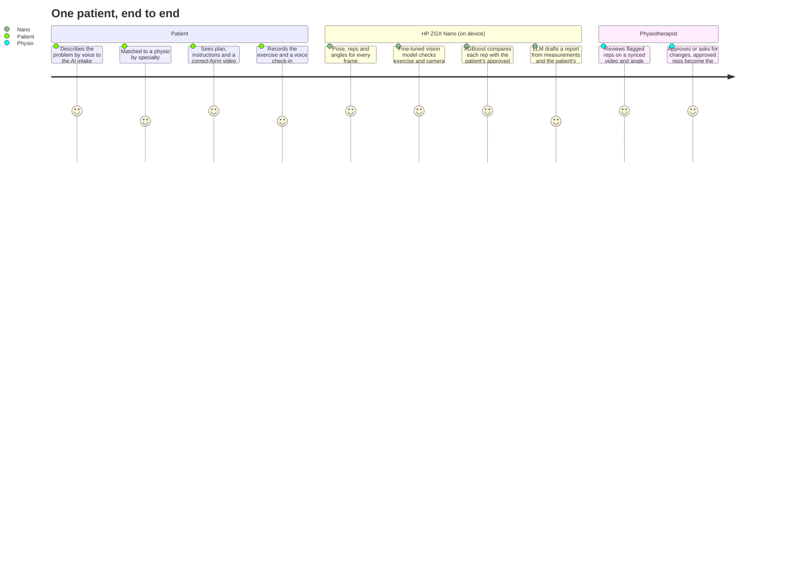
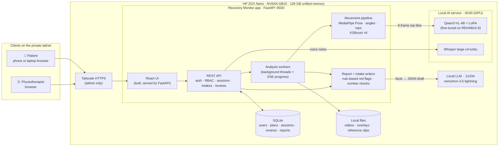
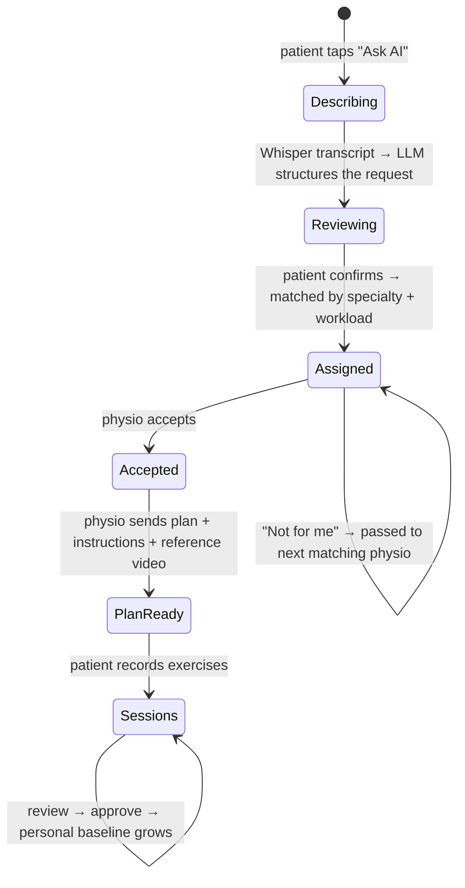

<div align="center">

# Recovery Monitor

### On-device AI that turns home rehab exercise into evidence a physiotherapist can trust

Built for the **HP ZGX Nano** (NVIDIA GB10). Video, voice and every AI model stay on the device.


-lightgrey)

</div>

---

## Contents

1. [The problem](#1-the-problem)
2. [What Recovery Monitor does](#2-what-recovery-monitor-does)
3. [Results at a glance](#3-results-at-a-glance)
4. [System architecture](#4-system-architecture)
5. [The AI stack](#5-the-ai-stack)
6. [Safety by design](#6-safety-by-design)
7. [Quick start](#7-quick-start-hp-zgx-nano)
8. [Using the app](#8-using-the-app)
9. [Detailed evaluation](#9-detailed-evaluation)
10. [Reproducing the models](#10-reproducing-the-models)
11. [Configuration](#11-configuration)
12. [API overview](#12-api-overview)
13. [Repository layout](#13-repository-layout)
14. [Privacy, data and limitations](#14-privacy-data-and-limitations)

---

## 1. The problem

Most physical rehabilitation happens **at home, unsupervised**. Between appointments a physiotherapist
cannot see whether exercises are done correctly, whether pain is creeping up, or whether the patient is doing
them at all. Patients film themselves, but a phone video is not evidence: someone still has to watch it,
measure it and compare it with last week. And a rehab video is **health data**, which many patients and
clinics will not upload to a cloud AI service.

## 2. What Recovery Monitor does

A patient describes their problem by voice, gets matched to a physiotherapist, records their exercises at
home and says how it felt. The **HP ZGX Nano** analyses everything locally and gives the physiotherapist a
review with measurements, flagged reps and a drafted report. **The physiotherapist makes every decision**;
approved sessions become that patient's personal baseline, so the analysis gets more personal over time.



**For patients**
- **Ask AI:** tap a glowing mic and describe the problem in your own words. Whisper transcribes on the
  device, and a local LLM turns it into a structured request (area, pain, duration, trend, goals, mood)
  that the patient can check and edit before sending.
- **Care team:** a live timeline: request sent → matched → accepted → plan ready.
- **Today:** the prescribed exercise, the physio's instructions and a *correct-form reference clip*. Record with
  the camera or upload a video, watch live analysis progress, then check in with a pain score and voice note.
- **My progress:** trend of movement quality and pain across sessions.

**For physiotherapists**
- **New requests:** auto-assigned by specialty (upper body / lower body / general mobility) and workload,
  each written up by the AI with the patient's own words, mood, red flags and a suggested starting exercise.
- **Plan editor:** all six supported exercises, with the ones that fit the patient's problem marked, fields
  that adapt to the exercise, and a matching correct-form reference video.
- **Review queue:** urgent sessions first. Each review shows the skeleton-overlay video synced to the joint-angle
  chart, rep-by-rep verdicts with reasons, the patient's pain and words, and an AI draft report that stays
  collapsed until you want the detail.

**Six exercises** (from REHAB24-6): squat, lunge, leg raise to the side, arm raise to the side, arm V-W,
push-ups with hands on a table.

## 3. Results at a glance

All numbers are measured on people the models never saw during training (leave-one-subject-out or held-out
subjects). Full tables are in [section 9](#9-detailed-evaluation).

| What | Result |
|---|---|
| Knee angle vs. 16-camera optical motion capture (side view, 9,825 frames) | **±5.3° mean absolute error** |
| Exercise recognition, fine-tuned Qwen3-VL-4B vs. zero-shot (476 held-out reps) | **63.4% → 99.2%** |
| Camera-view recognition, fine-tuned vs. zero-shot | **31.3% → 97.9%** |
| Vision model speed after fine-tuning | **2.92 s → 1.33 s per rep** |
| Incorrect-rep detection, XGBoost vs. patient baseline (F1, 6 exercises) | **0.62 – 0.85** |
| Rep counting, squat (390 annotated reps) | **91% precision, 87% recall** (97% recall filmed side-on) |
| Voice to text (Whisper large-v3-turbo on the GB10) | **11 s of speech in 0.25 s** |
| AI intake: real voice note → structured request | **~4 s**, fully on device |

## 4. System architecture

Everything runs on one HP ZGX Nano. Phones and laptops reach it over a private Tailscale network; nothing is
sent to a cloud AI service.



### How one exercise video is analysed


### From "it hurts" to an exercise plan



## 5. The AI stack

| Model | Role | Runs on | Trained by us? |
|---|---|---|---|
| **MediaPipe Pose Landmarker (full)** | 33 body landmarks per frame | Nano CPU | used as-is |
| **XGBoost × 6** (one per exercise) | probability each rep is off-form, relative to the patient's own approved reps | Nano CPU | **yes**, leave-one-subject-out |
| **Qwen3-VL-4B-Instruct + LoRA** | recognises the exercise and camera view; second opinion per rep | Nano GPU | **yes**, LoRA fine-tune (r = 16, 3 epochs) on 1,428 labelled reps |
| **Whisper large-v3-turbo** | voice notes and voice intake → text | Nano GPU | used as-is |
| **nemotron-3.5-lightning** (local LLM) | drafts the physio report and the intake request as strict JSON | Nano, served locally | used as-is, with guards |

Why a *per-patient baseline*: two people's "correct" squats differ more than one person's correct and
incorrect squats. Each rep's features are compared with the median of that patient's physio-approved reps, so
the classifier learns *change from your own normal*, and it improves as the physio approves sessions.

Why a *fine-tuned* vision model: zero-shot, Qwen3-VL confused leg raises and arm V-W with other exercises
and could barely tell the camera angle (31%). After a small LoRA fine-tune on person-cropped 8-frame tiles it
reaches 99% exercise and 98% view accuracy on unseen people, which lets the app catch "this is an arm raise,
but your plan is squats" and warn when the camera angle makes angles unreliable.

## 6. Safety by design

The AI prepares; the physiotherapist decides. Concretely:

- **Red flags are rules, not model output.** Severe pain (≥ 8/10), a pain jump of 2+ points, words like
  *swollen, numb, gave way, sharp pain*, the wrong exercise, or an unusable video always raise a flag, whatever
  the LLM writes.
- **Numbers are verified.** Every number in the LLM's report must appear in the measured facts; sentences with
  invented numbers are removed. If the LLM is unavailable, a plain template report is used.
- **The patient's words are quoted verbatim**, never paraphrased into something they did not say.
- **Intake guards:** the pain score is only filled in if the patient said a number; duration is parsed from
  their words; the suggested exercise must fit the body area; no diagnosis, no medical advice, no promises.
- **Nothing reaches the patient unreviewed.** The drafted patient message is shown only after the physio
  approves or requests changes.
- **Honest uncertainty.** Each result shows tracking confidence and the measured error for the camera angle
  used (±5.3° side-on vs. ±41.8° front-on for knee angle).
- **Access control on the server.** Hashed passwords (PBKDF2) and session tokens, role-based access: patients
  can only reach their own records, and therapist endpoints refuse patient accounts.

## 7. Quick start (HP ZGX Nano)

**Requirements:** Linux with an NVIDIA GPU (developed on the HP ZGX Nano, aarch64, CUDA 13), Python 3.12,
Node 20+, ffmpeg (bundled via `imageio-ffmpeg`), [Ollama](https://ollama.com) for the report LLM, and ~20 GB
of disk for models.

```bash
git clone https://github.com/aryaMehta26/recovery-monitor.git
cd recovery-monitor

scripts/setup.sh     # one time: rebuilds the fine-tuned adapter, installs Python/Node deps,
                     # downloads Qwen3-VL-4B, Whisper and the pose model, pulls the LLM, builds the UI
scripts/run_all.sh   # starts the GPU AI service (:8100) and the app (:8020), then prints a health check
```

Open **http://localhost:8020**. All seeded accounts use the password **`recovery-demo`**:

| Account | Role | What you see |
|---|---|---|
| `therapist.demo@example.com` | Physiotherapist | review queue, new requests, patients, plan editor |
| `jordan@demo.local` | Patient | several sessions, pain trending down |
| `sam@demo.local` | Patient | an urgent case: every rep flagged, pain 3 → 6 |
| `test@demo.local` | Patient | a real home video recorded by our team |

Or press **Sign up** to create a new patient or physiotherapist and try the full journey from scratch.

> **Demo data:** the seeded patients and reference clips are cut from the public REHAB24-6 dataset. To
> create them, place the dataset in `~/rm-data/rehab24` (videos + `Segmentation.csv`); `run_all.sh` then seeds
> them automatically. Without the dataset the app still runs, and you can sign up and upload your own videos.

### Open it on a phone

Phone browsers only allow camera and microphone on HTTPS. With Tailscale on the Nano and the phone:

```bash
tailscale serve --bg --https=8443 http://127.0.0.1:8020
# → https://<nano-name>.<tailnet>.ts.net:8443   (tailnet only, not public)
```

### Development mode

```bash
# AI service (GPU): Qwen3-VL + LoRA and Whisper
~/ft-venv/bin/uvicorn model.ai_service:app --host 127.0.0.1 --port 8100

# API with auto-reload
cd recovery-monitor-backend && ~/rm-venv/bin/uvicorn main:app --reload --port 8000

# UI with hot reload (proxies /api to :8000)
cd recovery-monitor-frontend && npm install && npm run dev      # http://localhost:5173

# tests
cd recovery-monitor-backend && ~/rm-venv/bin/python -m pytest -q
```

## 8. Using the app

**Try the whole story in five minutes**

1. **Sign up as a patient** → onboarding → **Ask AI** → pick *Knee* → tap the mic and say, for example:
   *"For two months my right knee hurts on the stairs, about a six out of ten, and it's getting worse. I want
   to get back to football."* Check what the assistant understood and send it.
2. **Care team** shows who you were matched with.
3. **Sign in as the matched physiotherapist** → **New requests** → read the AI note → **Accept & set plan** →
   pick an exercise (the AI's suggestion is marked) → add instructions → **Send plan to patient**.
4. **Back as the patient** → **Today** shows the plan, the instructions and a correct-form clip →
   **Record with camera** (side-on for squats and lunges, facing the camera for arm and leg raises).
5. Watch live analysis, then **Tell us how it felt** by voice.
6. **As the physiotherapist** → **Review queue** → open the session: synced video and angle chart, flagged reps
   (`J`/`K` to step through), the patient's words, and the AI draft behind **View full report** → approve.

**Things worth trying:** upload an arm raise while the plan says squats ("this looks like an arm raise");
film a squat from the front ("camera angle not ideal"); mention *swelling* in a voice note (priority flag);
open another patient's URL as a patient (redirected; the API returns 403).

## 9. Detailed evaluation

**Dataset:** REHAB24-6 (Černek et al., SISAP 2024): 10 people in motion-capture suits, 2 synchronised
cameras, physiotherapist-labelled correct/incorrect reps for 6 exercises. All splits are **by person**.

### Knee-angle accuracy vs. 16-camera motion capture (squats, per frame)

| Camera view | Frames | Mean abs. error | Median | 95th pct |
|---|---:|---:|---:|---:|
| **Side-on** | 9,825 | **5.3°** | 4.5° | 13.2° |
| Half-profile (45°) | 19,096 | 25.7° | 20.4° | 61.7° |
| Front | 9,825 | 41.8° | 39.7° | 86.5° |

This is why the app tells patients how to film each exercise and warns when the view is unreliable.

### Rep counting (temporal IoU ≥ 0.3) and incorrect-rep detection (leave-one-subject-out)

| Exercise | Rep precision | Rep recall | Recall, best view | Incorrect-rep F1: **XGBoost** | F1: single rule |
|---|---:|---:|---:|---:|---:|
| Squat | 91.4% | 87.4% | 96.9% (side) | **0.62** | 0.50 |
| Lunge | 88.9% | 87.4% | 97.7% (side) | **0.71** | 0.74 |
| Leg raise to the side | 85.1% | 71.9% | 93.1% (front) | **0.78** | 0.72 |
| Arm raise to the side | 74.7% | 61.5% | 86.4% (front) | **0.85** | 0.72 |
| Arm V-W | 70.7% | 64.9% | 90.4% (half-profile) | **0.77** | 0.73 |
| Push-ups (hands on table) | 77.5% | 46.7% | 93.5% (front) | **0.80** | 0.67 |

Thresholds are chosen for ~80% recall of incorrect reps: a false alarm costs the physio one click, a missed
problem costs the patient.

### Fine-tuned vision model (Qwen3-VL-4B + LoRA), held-out people 3 and 7, 476 reps

| | Zero-shot | **Fine-tuned** |
|---|---:|---:|
| Exercise recognition | 63.4% | **99.2%** |
| Camera-view recognition | 31.3% | **97.9%** |
| Valid JSON output | 100% | 100% |
| Seconds per rep (GB10) | 2.92 | **1.33** |

Per exercise, fine-tuned exercise recognition is 96–100% (zero-shot: 20% for leg raises, 27% for arm V-W).
The model's per-rep correctness opinion (60% accuracy) is shown to the physio as a *second opinion only*;
XGBoost against the patient's own baseline remains the primary signal.

## 10. Reproducing the models

```bash
~/rm-venv/bin/python -m model.prepare_data            # unzip REHAB24-6, pose models, manifest, person splits
~/rm-venv/bin/python -m model.extract_landmarks       # MediaPipe over every video
~/rm-venv/bin/python -m model.eval_angles             # knee angle vs motion capture
~/rm-venv/bin/python -m model.eval_reps               # rep counting
~/rm-venv/bin/python -m model.train_all               # XGBoost per exercise → model/artifacts/*_xgb.json

# vision model (GPU)
~/ft-venv/bin/python -m model.finetune.prepare_vlm_data   # person crops → 8-frame tiles, split by person
~/ft-venv/bin/python -m model.finetune.train_vlm          # LoRA r=16, 3 epochs, lr 1e-4
~/ft-venv/bin/python -m model.finetune.eval_vlm           # → model/results/vlm_*_test.json
```

Every number in this README comes from a file in [`model/results/`](model/results). The trained XGBoost models
are in [`model/artifacts/`](model/artifacts); the LoRA adapter is in
[`model/weights/vlm_adapter/`](model/weights/vlm_adapter), split into parts under GitHub's file-size limit
and reassembled with a checksum check by `scripts/setup.sh`.

## 11. Configuration

| Variable | Default | Purpose |
|---|---|---|
| `RM_APP_DATA` | `recovery-monitor-backend/data` | database, uploaded videos, reference clips |
| `RM_DATA` | `~/rm-data` | dataset, pose models, landmarks |
| `RM_AI_SERVICE_URL` | `http://127.0.0.1:8100` | GPU service for the vision model and Whisper |
| `RM_VLM_ADAPTER` | `model/weights/vlm_adapter` (via `run_all.sh`) | LoRA adapter folder |
| `RM_WHISPER` | `~/models/whisper-large-v3-turbo` | Whisper weights |
| `RM_LLM_URL` / `RM_LLM_MODEL` | `http://127.0.0.1:11434` / `nemotron-3.5-lightning` | local LLM for reports and intake |
| `RM_MAX_UPLOAD_MB` | `300` | upload limit |
| `RM_MAX_CONCURRENT_ANALYSES` | `2` | parallel analysis workers |

## 12. API overview

| Area | Endpoints |
|---|---|
| Auth | `POST /api/auth/signup` · `POST /api/auth/login` · `GET /api/auth/me` · `POST /api/auth/logout` |
| AI intake | `POST /api/patient/intakes/assist` (audio or text → structured request) · `POST /api/patient/intakes` |
| Therapist intake | `GET /api/therapist/intakes` · `POST …/{id}/claim` · `POST …/{id}/decline` (passes to next match) |
| Plans | `GET/POST /api/patients/{id}/protocol` · `GET /api/reference-videos` |
| Sessions | `POST /api/patients/{id}/sessions` (upload) · `GET /api/sessions/{id}/events` (SSE progress) · `POST …/voice` · `POST …/check-in` |
| Review | `GET /api/review-queue` · `POST /api/sessions/{id}/review` · `POST /api/sessions/{id}/report` (regenerate) |
| System | `GET /api/health` (live status of every model) · `GET /api/eval/summary` |

Interactive docs: **http://localhost:8020/docs**.

## 13. Repository layout

```
recovery-monitor/
├── model/                      # the ML: pose → features → reps → classifiers; evaluation
│   ├── pipeline.py             #   end-to-end analysis used by the app (6 exercises)
│   ├── exercises.py · features.py · analyze.py
│   ├── ai_service.py           #   GPU service: fine-tuned Qwen3-VL + Whisper (:8100)
│   ├── finetune/               #   VLM data prep, LoRA training, evaluation
│   ├── artifacts/              #   trained XGBoost models (one per exercise)
│   ├── weights/vlm_adapter/    #   LoRA adapter (split, checksummed)
│   └── results/                #   every reported metric, as JSON
├── recovery-monitor-backend/   # FastAPI app (:8020)
│   └── app/
│       ├── routes/             #   auth, patients, sessions, review, intakes, system
│       ├── jobs.py             #   background analysis + per-patient baseline
│       ├── report.py           #   LLM report with rule-based red flags and number checks
│       ├── intake_ai.py        #   Whisper + LLM intake assistant with guards
│       └── reference_seed.py   #   correct-form clips for all six exercises
├── recovery-monitor-frontend/  # React + Vite UI (served by the backend once built)
├── scripts/                    # setup.sh · run_all.sh
└── docs/                       # API contract, team guide
```

## 14. Privacy, data and limitations

- **Privacy:** video, audio, transcripts and reports are processed and stored only on the Nano. No cloud AI
  API is called; the app keeps working without internet access.
- **Not a medical device.** Recovery Monitor produces evidence for a licensed physiotherapist, who makes every
  clinical decision. It does not diagnose or prescribe.
- **Data:** REHAB24-6 is licensed CC BY-NC 4.0 (Černek et al., SISAP 2024). It was recorded in a lab by
  10 volunteers; validating on real patients filming at home is the next step. We tested our own home
  recordings, but not at clinical scale.
- **Known limits:** angle accuracy is validated for squats (knee) against motion capture; other exercises are
  validated for rep counting and correctness. The camera angle matters a lot (see section 9), so the app coaches
  patients on how to film and says when a view is unreliable. The report LLM runs locally through Ollama in
  this build; the endpoint is configurable so a different local server (such as HP Z Runtime) can host it.

---

<div align="center">

**Recovery Monitor** · Edge AI SJSU Hackathon 2026 · built on the HP ZGX Nano

Arya Mehta · Aishwarya Iyer · Prajwal · Om Dhankara · Keith Gonsalves

</div>
